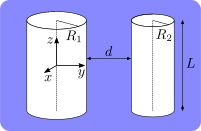

# cascy-ded
Python package to calculate the Casimir energy between dielectric cylinders of arbitrary radii immersed in water.
The Casimir energy is calculated within the scattering theory using plane waves as a basis for the electromagnetic modes.
The separation between the cylinders is assumed to be much smaller than their lengths, so that edge effects can be neglected.

## Installation

First create an invironment to install the packages.

    pip install -e .
    
